# CLAUDE.md

This file provides guidance to Claude Code (claude.ai/code) when working with code in this repository.

## Project Overview

AxonHub is an all-in-one AI development platform that serves as a unified API gateway for multiple AI providers. It provides OpenAI and Anthropic-compatible API interfaces with automatic request transformation, enabling seamless communication between clients and various AI providers through a sophisticated bidirectional data transformation pipeline.

### Core Architecture
- **Transformation Pipeline**: Bidirectional data transformation between clients and AI providers
- **Unified API Layer**: OpenAI/Anthropic/Gemini-compatible interfaces with automatic translation
- **Channel Management**: Multi-provider support with configurable channels (20+ providers)
- **Thread-aware Tracing**: Request tracing with thread linking capabilities
- **Permission System**: RBAC with fine-grained access control and Ent privacy policies
- **Multi-project Support**: Project-scoped resource isolation
- **System Management**: Web-based configuration interface with GraphQL API

## Module Structure

```mermaid
graph TD
    A["AxonHub (Root)"] --> B["cmd/axonhub"]
    A --> C["internal"]
    A --> D["llm"]
    A --> E["frontend"]
    A --> F["conf"]
    A --> G["integration_test"]
    A --> H["deploy"]
    A --> I["docs"]
    A --> J["scripts"]

    C --> C1["server"]
    C --> C2["ent"]
    C --> C3["authz"]
    C --> C4["scopes"]
    C --> C5["pkg"]
    C --> C6["contexts"]
    C --> C7["objects"]
    C --> C8["log"]
    C --> C9["metrics"]
    C --> C10["tracing"]
    C --> C11["dumper"]
    C --> C12["build"]

    C1 --> C1A["api"]
    C1 --> C1B["biz"]
    C1 --> C1C["gql"]
    C1 --> C1D["middleware"]
    C1 --> C1E["backup"]
    C1 --> C1F["gc"]
    C1 --> C1G["dependencies"]
    C1 --> C1H["static"]
    C1 --> C1I["db"]

    D --> D1["transformer"]
    D --> D2["pipeline"]
    D --> D3["httpclient"]
    D --> D4["streams"]
    D --> D5["oauth"]

    D1 --> D1A["openai"]
    D1 --> D1B["anthropic"]
    D1 --> D1C["gemini"]
    D1 --> D1D["deepseek"]
    D1 --> D1E["aisdk"]
    D1 --> D1F["antigravity"]
    D1 --> D1G["+ 10 more"]

    click D "./llm/CLAUDE.md" "LLM module docs"
    click C1 "./internal/server/CLAUDE.md" "Server module docs"
    click C2 "./internal/ent/CLAUDE.md" "Ent ORM module docs"
    click C3 "./internal/authz/CLAUDE.md" "Authz module docs"
    click C4 "./internal/scopes/CLAUDE.md" "Scopes module docs"
    click C5 "./internal/pkg/CLAUDE.md" "Pkg utilities docs"
    click E "./frontend/CLAUDE.md" "Frontend module docs"
```



## Module Index

| Module | Path | Language | Description | Has Tests | CLAUDE.md |
|--------|------|----------|-------------|-----------|-----------|
| Entry Point | `cmd/axonhub/` | Go | Application main, CLI commands | No | -- |
| Config | `conf/` | Go | YAML/env config loading via Viper | No | -- |
| LLM | `llm/` | Go (separate module) | Transformer pipeline, 20+ provider adapters | Yes | [Link](./llm/CLAUDE.md) |
| Server | `internal/server/` | Go | HTTP server, routes, middleware | Yes | [Link](./internal/server/CLAUDE.md) |
| Business Logic | `internal/server/biz/` | Go | Core services (channels, auth, models, etc.) | Yes (extensive) | -- |
| API Handlers | `internal/server/api/` | Go | REST API handlers per provider format | Yes | -- |
| GraphQL | `internal/server/gql/` | Go | GraphQL resolvers and schemas | Yes | -- |
| Backup | `internal/server/backup/` | Go | Auto-backup and restore | Yes | -- |
| GC | `internal/server/gc/` | Go | Scheduled database cleanup | Yes | -- |
| Ent ORM | `internal/ent/` | Go (generated) | Database schemas, CRUD, migrations | Yes | [Link](./internal/ent/CLAUDE.md) |
| Authorization | `internal/authz/` | Go | Principals, scopes, bypass | Yes | [Link](./internal/authz/CLAUDE.md) |
| Privacy Rules | `internal/scopes/` | Go | Ent privacy policies, access rules | Yes | [Link](./internal/scopes/CLAUDE.md) |
| Utilities | `internal/pkg/` | Go | Cache, JSON, Redis, regex, time utils | Yes | [Link](./internal/pkg/CLAUDE.md) |
| Contexts | `internal/contexts/` | Go | Request context, trace, thread management | Yes | -- |
| Objects | `internal/objects/` | Go | Shared domain types (GUID, prices, etc.) | Yes | -- |
| Logging | `internal/log/` | Go | Structured logging with zap | Yes | -- |
| Metrics | `internal/metrics/` | Go | OpenTelemetry metrics | No | -- |
| Tracing | `internal/tracing/` | Go | Distributed tracing | Yes | -- |
| Dumper | `internal/dumper/` | Go | Debug data dumping | Yes | -- |
| Frontend | `frontend/` | TypeScript/React | Web management dashboard | Yes (Playwright) | [Link](./frontend/CLAUDE.md) |
| Integration Tests | `integration_test/` | Go | OpenAI/Anthropic/Gemini integration tests | Yes | -- |
| Deployment | `deploy/` | Shell/YAML | Docker, Helm, systemd, scripts | No | -- |
| Documentation | `docs/` | Markdown | API reference, guides (en/zh) | No | -- |
| Scripts | `scripts/` | Shell/JS | E2E, migration, sync, lint scripts | No | -- |

## Development Commands

### Backend (Go)
```bash
# Run the main server
go run cmd/axonhub/main.go

# Generate GraphQL and Ent code (run after schema changes)
make generate

# Run tests (root module only)
go test ./...

# Run all backend tests (root + llm modules)
make test-backend-all

# Run linting
golangci-lint run

# Build the application
make build-backend

# Use air for hot reload (development) - server auto-restarts on changes
air
```

### Frontend (React)
```bash
# Navigate to frontend directory
cd frontend

# Install dependencies
pnpm install

# Start development server (port 5173) - already configured with backend proxy
pnpm dev

# Build for production
pnpm build

# Run linting
pnpm lint

# Format code
pnpm format

# Check for unused dependencies
pnpm knip

# Tests (Playwright)
pnpm test:e2e            # run E2E suite via scripts/e2e
pnpm test:e2e:headed     # headed browser mode
pnpm test:e2e:ui         # Playwright UI runner
pnpm test:e2e:debug      # debug mode
pnpm test:e2e:report     # open last HTML report
pnpm test:ui             # Playwright UI (direct)
pnpm test:ui:headed      # Playwright headed (direct)
```

### Make Commands
```bash
# Generate GraphQL and Ent code
make generate

# Build backend only
make build-backend

# Build frontend only
make build-frontend

# Build both frontend and backend
make build

# Cleanup test database
make cleanup-db

# E2E Testing
make e2e-test                    # Run full E2E test suite
make e2e-backend-start          # Start E2E backend service
make e2e-backend-stop           # Stop E2E backend service
make e2e-backend-status         # Check E2E backend status
make e2e-backend-restart        # Restart E2E backend service
make e2e-backend-clean          # Clean up E2E test files

# Migration Testing
make migration-test TAG=v0.1.0  # Test migration from specific tag
make migration-test-all         # Test migration for all recent versions
make migration-test-all-dbs TAG=v0.1.0  # Test migration across all DB types

# Data Syncing
make sync-faq                   # Sync FAQ from GitHub issues
make sync-models                # Sync model developers data

# Utilities
make filter-logs                # Filter and analyze load balance logs
```

## Architecture Overview

### Technology Stack
- **Backend**: Go 1.26+ with Gin HTTP framework, Ent ORM, gqlgen GraphQL, FX dependency injection
- **Frontend**: React 19 with TypeScript 5.8, TanStack Router, TanStack Query, Zustand, Tailwind CSS 4
- **Database**: SQLite (development), PostgreSQL/MySQL/TiDB (production)
- **Authentication**: JWT with role-based access control
- **Go Modules**: Two separate modules -- root (`github.com/looplj/axonhub`) and LLM (`github.com/looplj/axonhub/llm`)

### Backend Structure
- **Server Layer** (`internal/server/`): HTTP server and route handling with Gin
- **Business Logic** (`internal/server/biz/`): Core business logic and services
- **API Layer** (`internal/server/api/`): REST and GraphQL API handlers
- **Database** (`internal/ent/`): Ent ORM for database operations
- **LLM Integration** (`llm/`): AI provider transformers and pipeline processing (separate Go module)
- **Context Management** (`internal/contexts/`): Context handling utilities
- **Utilities** (`internal/pkg/`): Shared utilities (cache, JSON, Redis, errors)
- **Auth & Scopes** (`internal/authz/`, `internal/scopes/`): Permission system with role-based access control

### Frontend Structure
- **TanStack Router**: File-based routing in `frontend/src/routes/`
- **TanStack Query**: Data fetching and caching with GraphQL
- **TanStack Table**: Data tables with pagination/filtering
- **GraphQL**: API communication via `frontend/src/gql/`
- **Shadcn/ui**: Component library with Tailwind CSS
- **Zustand**: State management in `frontend/src/stores/`
- **AI SDK**: Integration for enhanced AI capabilities
- **Feature-based Organization**: Components organized by feature in `frontend/src/features/` (18 feature modules)
- **Shared Components**: Reusable components in `frontend/src/components/`
- **Custom Hooks**: Shared hooks in `frontend/src/hooks/`
- **Internationalization**: i18n support in `frontend/src/locales/` (en.json, zh.json)
- **Utilities**: Shared utilities in `frontend/src/utils/`

### Key Components

#### LLM Transformer System
- **Pipeline Architecture**: Enhanced request processing with cross-channel retry and same-channel retry
- **Transformer Interfaces**: `Inbound` (client-to-unified), `Outbound` (unified-to-provider), `Transformer` (extended with rerank/embed)
- **Stream Processing**: Enhanced SSE support with chunk aggregation
- **Supported Providers**: OpenAI, Anthropic, Gemini, DeepSeek, AI SDK, Bedrock, Antigravity, Bailian, Doubao, Moonshot, OpenRouter, xAI, NanoGPT, ModelScope, Longcat, Zai, Jina, Claude Code, Codex
- **Auto-save**: Configurable persistence of chat requests and responses
- **Load Balancing**: Round-robin and failover strategies
- **Middleware**: Pipeline middleware for max tokens, billing headers, usage extraction

#### Database Schema
- **Users**: Authentication and role management with soft delete
- **Roles**: Permission groups with scope-based access
- **Projects**: Multi-project resource isolation
- **Channels**: AI provider configurations
- **API Keys**: Authentication tokens with quota support
- **Requests**: Request logging and execution tracking
- **Request Executions**: Per-channel execution records
- **Traces**: Distributed request tracing
- **Threads**: Conversation threading
- **Models**: AI model definitions and pricing
- **Prompts**: Prompt template management
- **Data Storages**: External data storage configs
- **Usage Logs**: Detailed cost/usage tracking
- **Channel Model Prices**: Per-model pricing with versioning
- **Channel Override Templates**: Request transformation templates
- **Channel Probes**: Health check results
- **Systems**: System-wide configuration (storeChunks, etc.)
- **Provider Quota Status**: Provider-level quota tracking
- **Soft Delete**: Data safety across all entities

#### Permission System
- **Enhanced Scopes**: read_channels, write_channels, read_users, read_settings, write_settings
- **Owner scope**: Full system access
- **Role-based access control**: Users can have multiple roles
- **Ent privacy policies**: Database-level permission enforcement via `internal/scopes/`
- **Granular permissions**: Fine-grained access control
- **Project-scoped permissions**: Per-project role assignments

#### System Management
- **Web Interface**: Complete system settings management
- **Configuration Options**: Controllable persistence and system behavior
- **Real-time Updates**: Live configuration changes
- **GraphQL API**: System configuration endpoints
- **Backup/Restore**: JSON-based backup with auto-scheduling


### Development Workflow

#### General Notes
- All summary files should be stored in `.windsurf/summary` directory if available

#### Backend Development
1. **Code Changes**: Modify Go code in `internal/` directory
2. **Schema Changes**: If modifying Ent schemas (`internal/ent/schema/`), run `make generate`
   - When changing any Ent schema or GraphQL schema, run `make generate` to regenerate models and resolvers
   - The `make generate` command automatically enters the gql directory and runs go generate
3. **GraphQL Changes**: If modifying GraphQL schemas (`internal/server/gql/`), run `make generate`
4. **Hot Reload**: Use `air` for automatic server restart on changes (configured in `.air.toml`)
   - **CRITICAL**: The server in development is managed by air - it will rebuild and start when code changes, so DO NOT restart manually
   - Air watches `.go` and `.yml` files
   - Excludes directories: `frontend`, `integration_test`, `scripts`, `tools`, `examples`
   - Builds to `./tmp/axonhub`

   **Dev vs prod builds**
   - Dev hot-reload uses Air (`.air.toml`) and builds to `./tmp/axonhub`.
   - Production build uses `make build-backend` and outputs `./axonhub`.

5. **Building**: Use `make build-backend` to build the server for production deployment
6. **Testing**: Run `go test ./...` for unit tests
7. **Linting**: Run `golangci-lint run` before committing

#### Frontend Development
1. **Start Dev Server**: Run `pnpm dev` in `frontend/` directory (port 5173)
   - **CRITICAL**: DO NOT restart the development server - it's already started and managed
2. **Proxy Configuration**: Frontend proxies API requests to backend on port 8090
3. **Code Changes**: Modify React components in `frontend/src/`
4. **Internationalization**:
   - **REQUIRED**: MUST ADD i18n key in the `frontend/src/locales/*.json` files if creating a new key in the code
   - **REQUIRED**: MUST KEEP THE KEY IN THE CODE AND JSON FILE THE SAME
   - Support both English and Chinese translations (`en.json` and `zh.json`)
   - Add i18n keys to both `frontend/src/locales/en.json` and `frontend/src/locales/zh.json`
5. **Testing**: Use `pnpm test:e2e` for E2E tests or `pnpm test:ui` for Playwright UI tests
6. **Linting**: Run `pnpm lint` before committing

**Additional Frontend Development Rules:**
- Use `pnpm` as the package manager exclusively
- Use GraphQL input to filter data instead of filtering in the frontend
- Search filters must use debounce to avoid too many requests
- Add sidebar data and route when adding new feature pages
- Use `extractNumberID` to extract int id from the GUID
- Follow component organization in `frontend/src/features/`

#### Database Development
1. **Schema Changes**: Modify Ent schemas in `internal/ent/schema/`
2. **Code Generation**: Run `make generate` to regenerate Ent code
3. **Migrations**: Auto-applied on server start
4. **Testing**: Use `enttest.NewEntClient(t, "sqlite3", "file:ent?mode=memory&_fk=0")` for isolated tests

#### Integration Testing
1. **E2E Tests**: Run `make e2e-test` for full integration test suite
2. **Migration Tests**: Run `make migration-test TAG=v0.1.0` to test database migrations
3. **Cross-DB Tests**: Run `make migration-test-all-dbs TAG=v0.1.0` for multi-database migration testing

## Important Files

### Backend
- `cmd/axonhub/main.go`: Application entry point
- `internal/server/server.go`: HTTP server configuration and FX bootstrap
- `internal/server/routes.go`: All HTTP route definitions
- `llm/pipeline/pipeline.go`: Pipeline factory and execution
- `llm/transformer/interfaces.go`: Transformer interface definitions
- `internal/ent/schema/`: Database schema definitions (24 schema files)
- `internal/pkg/`: Shared utilities and helpers
- `conf/conf.go`: Configuration loading and validation
- `internal/server/gql/`: GraphQL schema and resolvers (15 `.graphql` files)
- `internal/server/biz/channel_llm.go`: Channel-to-transformer wiring

### Frontend
- `frontend/src/main.tsx`: Application entry point
- `frontend/src/routes/`: File-based routing (40+ route files)
- `frontend/src/features/`: Feature-based component organization (18 feature modules)
- `frontend/src/features/system/`: System management interface
- `frontend/src/locales/`: Internationalization files (en.json, zh.json)
- `frontend/src/gql/graphql.ts`: GraphQL client
- `frontend/src/stores/`: Zustand stores (auth, project)

### Configuration & Documentation
- `config.yml` / `config.example.yml`: Main configuration files
- `AGENTS.md`: Repository guidelines for contributors
- `README.md` / `README.zh-CN.md`: Project documentation
- `docs/`: Detailed documentation and architecture diagrams (en + zh)

## Key Development Patterns

### Adding a New AI Provider Channel
When introducing a new provider channel, keep backend and frontend changes aligned:

1. **Extend the channel enum in the Ent schema** -- add the provider key to the `field.Enum("type")` list in `internal/ent/schema/channel.go` and regenerate Ent artifacts
2. **Wire the outbound transformer** -- update the switch in `ChannelService.buildChannel` to construct the correct outbound transformer for the new enum
3. **Sync the frontend schema** -- update:
   - Zod schema in `frontend/src/features/channels/data/schema.ts`
   - Channel configuration in `frontend/src/features/channels/data/constants.ts`
   - Internationalization in `frontend/src/locales/en.json` and `frontend/src/locales/zh.json`

### Database Schema Changes
- Always run `make generate` after modifying Ent schemas
- Use `enttest.NewEntClient(t, "sqlite3", "file:ent?mode=memory&_fk=0")` for testing
- Follow soft delete patterns across all entities

### Go Development Patterns
- **REQUIRED**: USE `github.com/samber/lo` package to handle collection, slice, map, ptr, etc.
- Follow dependency injection patterns using FX framework
- Use structured logging with zap
- Implement proper context propagation
- **Key Dependencies**:
  - `entgo.io/ent` - ORM framework with code generation
  - `github.com/99designs/gqlgen` - GraphQL code generation
  - `github.com/gin-gonic/gin` - HTTP framework
  - `go.uber.org/fx` - Dependency injection
  - `github.com/google/uuid` - UUID generation
  - `github.com/redis/go-redis/v9` - Redis client
  - `github.com/jackc/pgx/v5` - PostgreSQL driver
  - `github.com/go-sql-driver/mysql` - MySQL driver

### Biz Service Rules
- **REQUIRED**: Ensure the dependency service not be nil, the logic code should not check the service is nil.
- **REQUIRED**: Dependency services are guaranteed initialized; business logic must not add nil checks.

### Error Handling
- **REQUIRED**: Always handle errors using the unified error response format from `internal/pkg/errors`
- Implement proper error wrapping with context
- Follow middleware-based error recovery patterns

### GraphQL Development
- **Method Signatures/New Fields**: Resolver method signatures and new field definitions should always be generated by modifying `*.graphql` schema files and running `make generate`
- **Implementation Content**: The implementation body of existing resolver methods can be manually modified
- Run `make generate` from the project root after schema changes
- Use GraphQL input filtering instead of frontend filtering for data queries

#### Adding New GraphQL Types
When adding new types or inputs to the GraphQL schema, you need to:

1. **Add the type/input definition** in the appropriate `.graphql` file in `internal/server/gql/`
2. **Add type mapping in `gqlgen.yml`** under the `models:` section - map the GraphQL type to the Go type:
   ```yaml
   MyNewType:
     model:
       - github.com/looplj/axonhub/internal/package.MyType
   MyNewInput:
     model:
       - github.com/looplj/axonhub/internal/package.MyInput
   ```
3. **Run `make generate`** to regenerate the code
4. **Implement the resolver** in the appropriate `*_resolvers.go` file

## Quality gates (match CI / pre-commit)

Backend:
- `go test -v --short ./...`
- `golangci-lint run`

Pre-commit hooks (see `.pre-commit-config.yaml`) also run:
- `go mod tidy`

## Testing

### Backend Testing
- **Unit Tests**: Go unit tests with testify
- **Integration Tests**: Database integration tests with in-memory SQLite
- **Test Database**: Use `enttest.NewEntClient(t, "sqlite3", "file:ent?mode=memory&_fk=0")` for isolated tests
- **Code Quality**: `golangci-lint run` for Go linting
- **Error Handling**: Use unified error format from `internal/pkg/errors`

### Frontend Testing
- **E2E Tests**: Playwright E2E tests with UI and headed modes
- **Test Commands**:
  - `pnpm test:e2e` - Run full E2E test suite
  - `pnpm test:e2e:headed` - Run E2E tests in headed mode
  - `pnpm test:e2e:ui` - Run E2E tests in UI mode
  - `pnpm test:e2e:debug` - Run E2E tests in debug mode
  - `pnpm test:ui` - Run Playwright tests in UI mode
  - `pnpm test:ui:headed` - Run Playwright tests in headed mode
- **Code Quality**: `pnpm lint` for TypeScript/ESLint checking
- **Test Credentials**: Frontend testing uses `my@example.com` / `pwd123456`

### Integration Testing
- **E2E Test Suite**: Use `make e2e-test` or `bash ./scripts/e2e/e2e-test.sh` for full integration tests
- **Migration Testing**: Use `make migration-test TAG=v0.1.0` to test database migrations
- **Cross-DB Testing**: Use `make migration-test-all-dbs TAG=v0.1.0` to test migrations across all supported databases
- **Test Cleanup**: Use `make cleanup-db` to remove playwright test data from database

## Key Features in Development
- Enhanced transformer stream aggregation
- Configurable persistence behavior
- System options for controlling data storage
- Improved error handling and recovery mechanisms
- Stream closing when client disconnects
- Real-time request tracing and monitoring


## Configuration

### Environment Setup
- Uses SQLite database (axonhub.db) by default
- Configuration loaded from `conf/conf.go` with YAML and env var support
- Logging with structured JSON output using zap
- FX dependency injection framework
- Go version: 1.26+
- Frontend development server: port 5173 (proxies to backend)
- Backend API: port 8090

### Database Support
- **Development**: SQLite (default, auto-migration)
- **Production**: PostgreSQL 15+, MySQL 8.0+, TiDB V8.0+
- **Cloud**: TiDB Cloud, Neon DB (serverless options)
- All support automatic schema migration

### Key Configuration Files
- `config.yml` / `config.example.yml`: Main configuration files (YAML format)
- `.air.toml`: Air hot reload configuration for backend development
- `.golangci.yml`: Go linting configuration
- `.pre-commit-config.yaml`: Git pre-commit hooks
- `frontend/vite.config.ts`: Frontend build configuration
- `docker-compose.yml`: Docker Compose configuration for containerized deployment
- `render.yaml`: Render deployment configuration

### Configuration Management
- **Primary Config**: `config.yml` (create from `config.example.yml`)
- **Environment Variables**: All configuration options can be overridden with environment variables
  - Format: `AXONHUB_{SECTION}_{KEY}` (e.g., `AXONHUB_SERVER_PORT=8090`)
  - Nested keys use underscores (e.g., `AXONHUB_SERVER_CORS_ENABLED=true`)
- **Database Support**: Configurable via `db.dialect` and `db.dsn`
  - SQLite (default): `dialect: "sqlite3"`, `dsn: "axonhub.db"`
  - PostgreSQL: `dialect: "postgres"`, `dsn: "host=..."`
  - MySQL: `dialect: "mysql"`, `dsn: "user:pass@tcp(...)/axonhub"`
  - TiDB: `dialect: "tidb"`, `dsn: "user.root:pass@tcp(...)/axonhub?tls=true"`

## Common Development Tasks

### Running a Single Test
```bash
# Backend: Run specific test
go test -v -run TestFunctionName ./path/to/package

# Frontend: Run specific test file
pnpm test:e2e -- path/to/test.spec.ts
```

### Database Migration
```bash
# Generate new migration after schema changes
make generate

# The migration will be auto-applied on server start
```

### Debugging Stream Processing
- Check `llm/pipeline/` for stream aggregation logic
- Monitor SSE connections in browser DevTools Network tab
- Use request tracing with `AH-Trace-Id` header for debugging

### Performance Optimization
- Use request tracing to identify bottlenecks
- Monitor database queries with Ent's built-in logging
- Check channel load balancing configuration for optimal distribution

## AI Usage Guidelines

- Refer to module-specific `CLAUDE.md` files linked in the Module Index above for detailed per-module context.
- When modifying a specific module, read its CLAUDE.md first for conventions and patterns.
- The `llm/` directory is a separate Go module; import paths use `github.com/looplj/axonhub/llm/...`.
- Generated files (in `internal/ent/`, `internal/server/gql/generated.go`, `internal/server/gql/models_gen.go`) should not be manually edited.

## Changelog

- **2026-02-21**: Architecture scan -- added module structure diagram (Mermaid), module index table, expanded provider list, AI usage guidelines, detailed schema list. Created module-level CLAUDE.md for `llm/`, `internal/server/`, `internal/ent/`, `internal/authz/`, `internal/scopes/`, `internal/pkg/`, `frontend/`. Created `.claude/index.json`.
